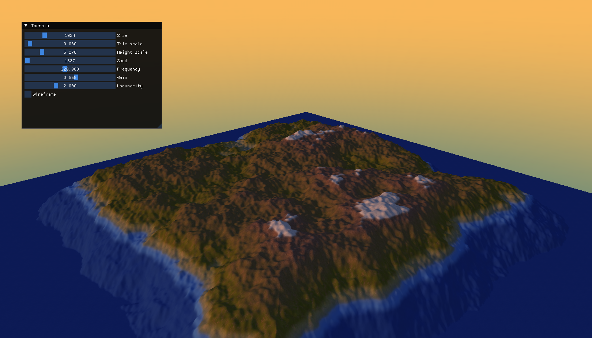

# Procedural terrain generator
An interactive terrain-generation application developed in C++ and OpenGL as part of a bachelor diploma project. It combines Perlin noise with fractional Brownian motion (fBm) to generate reproducible island-shaped terrain.

## Features
 - Procedural height-map generation using Perlin noise and fBm
 - Seed-based reproducible terrain
 - Island shaping through a falloff function
 - Mesh generation with calculated vertex normals
 - Height-based textures, lighting and programmable shaders
 - Orbit camera and skybox
 - Real-time parameter controls with Dear ImGui

## Technologies
C++, OpenGL and Dear ImGui.

